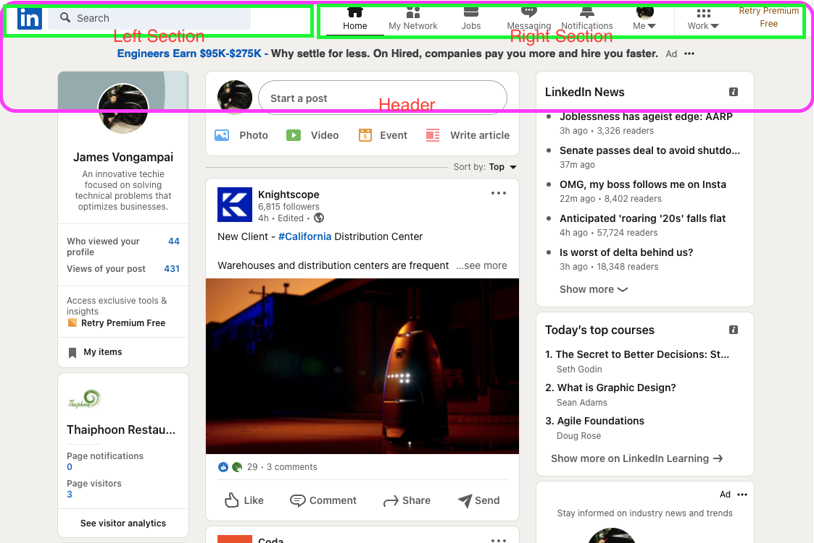
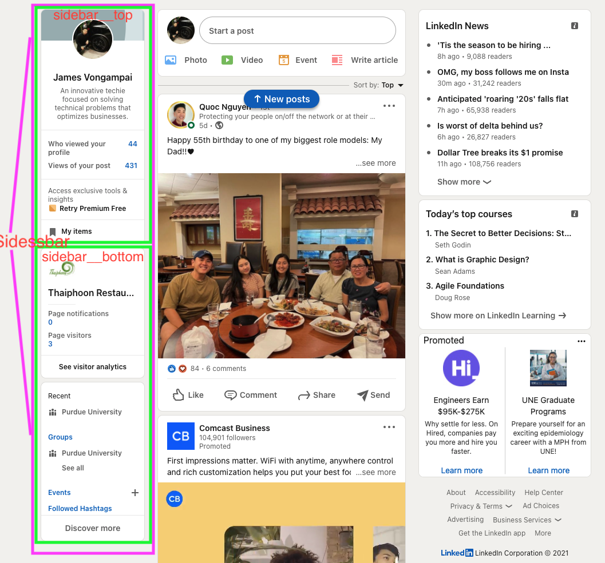

#linkedin-rebuild

## Project Details:

### Thinking in React - Component Based
1. Header Section (Nav / Search Bar)
1. Left Section (Left Sidebar)
1. Middle Section (Feed)
1. Right Section (Right Sidebar / Widget)

#### Header Section
* Header Breakdown

  * The header contains the top portion of the interface which is composed of a left section and right section
  * Left Section: Logo, Search Input
  * Right Section: Nav component that has many different links
  * `<HeaderOption />` as a reusable component

#### Left Sidebar Section
* Left Sidebar Breakdown:

### CSS Styling
1. BEM (Block Element Modifiers) Naming Convention CSS in React
  * Eliminate non-clashing css class names
  * Flexbox `display: flex` property, `align-items: center` (center on x-axis)

### Material UI
  * Icons

### Utilizing Reusable Components
  * Header Options