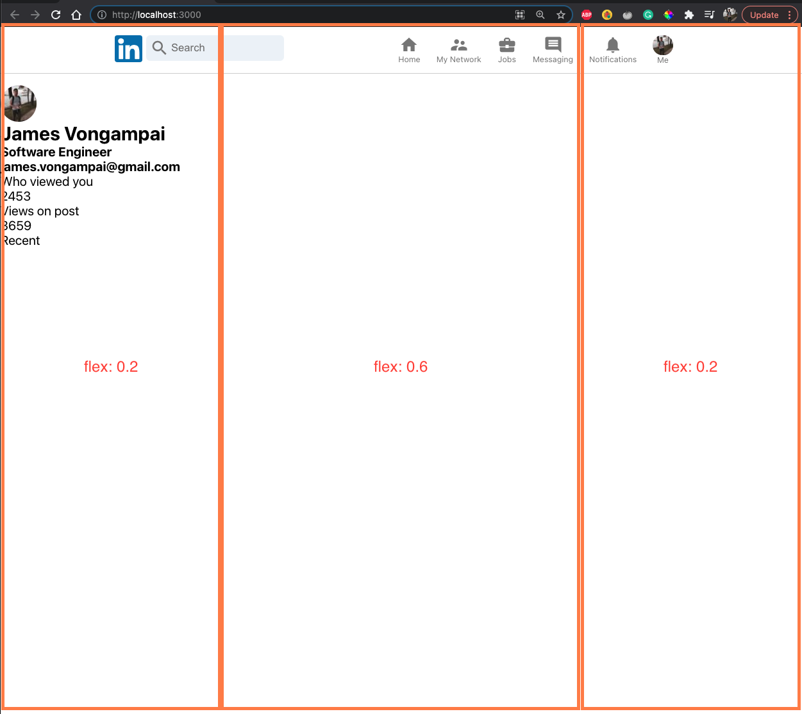

#linkedin-rebuild

## Project Details:

### Thinking in React - Component Based
1. Header Section (Nav / Search Bar)
1. Left Section (Left Sidebar)
1. Middle Section (Feed)
1. Right Section (Right Sidebar / Widget)

#### Header Section
* Header Breakdown

  * The header contains the top portion of the interface which is composed of a left section and right section
  * Left Section: Logo, Search Input
  * Right Section: Nav component that has many different links
  * `<HeaderOption />` as a reusable component

#### Left Sidebar Section
* Left Sidebar Breakdown:

  * The sidebar has a main container that has a CSS property of `flex: 0.2` for responsive sizing
  * Nested are three div containers that are targeted with CSS styling
  * Material UI is used for `<Avatar />` profile display

#### Feed Section
* Feed / Sizing Breakdown

  * The feed is where the main content is and has an input with an icon in the top portion
### CSS Styling
1. BEM (Block Element Modifiers) Naming Convention CSS in React
  * Eliminate non-clashing css class names
  * Flexbox `display: flex` property, `align-items: center` (center on x-axis)

### Material UI
  * Icons

### Utilizing Reusable Components
  * Header Options